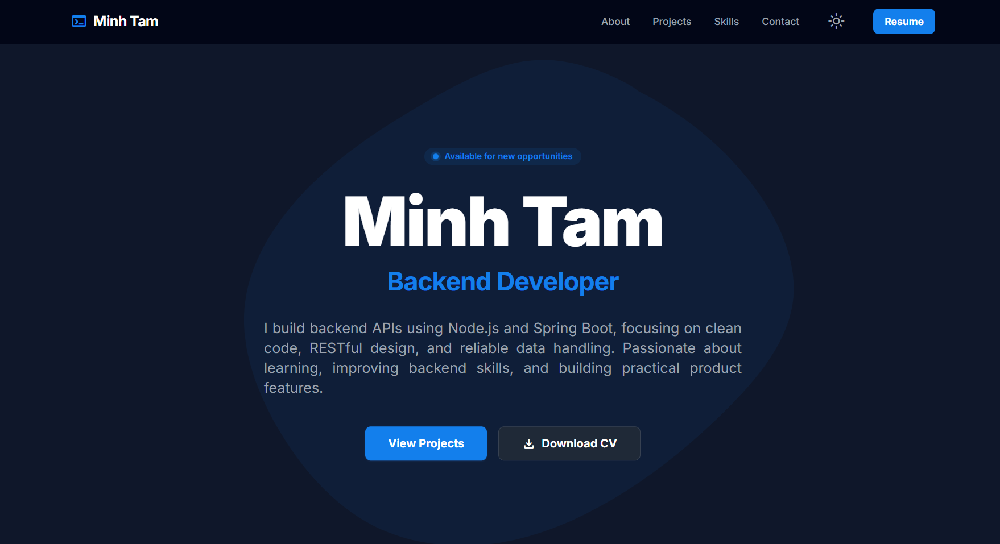

## Minh Tam – Portfolio

Modern personal portfolio for **Pham Minh Tam** – Backend Developer (Node.js, Spring Boot).  
Ứng dụng giới thiệu bản thân, kỹ năng và các dự án, với giao diện hiện đại, dark/light mode và animation mượt.



---

### 🚀 Live Demo

-   **Live Portfolio**: `minh-tam-portfolio.vercel.app`

---

### ✨ Features

-   **Light/Dark Mode**: Chuyển qua lại giữa giao diện sáng/tối, lưu trạng thái vào `localStorage`.
-   **Modern Design**: Thiết kế tối giản, chuyên nghiệp, tập trung vào nội dung và khả năng đọc.
-   **Smooth Animations**: Hiệu ứng xuất hiện section mượt mà với **Motion** từ [`motion.dev`](https://motion.dev/).
-   **Fully Responsive**: Tối ưu cho mọi kích thước màn hình (mobile, tablet, desktop).
-   **Hero Section**: Giới thiệu nhanh, nút xem dự án và tải CV.
-   **About, Projects, Skills, System Thinking**: Trình bày kinh nghiệm, tư duy hệ thống và các dự án nổi bật.
-   **Contact Form**: Form liên hệ đơn giản, dữ liệu demo được lưu vào `localStorage`.
-   **Smooth Scroll & Scroll To Top**: Cuộn mượt tới từng section và nút về đầu trang.

---

### 🛠️ Tech Stack

-   **Frontend**
    -   **React 19** + **TypeScript**
    -   **Vite 6** (dev server & build)
-   **Styling**
    -   **Tailwind CSS (CDN)** cho layout và style utility-first
    -   Custom CSS nhỏ cho các chi tiết giao diện
-   **Animations**
    -   **Motion** từ [`motion.dev`](https://motion.dev/) cho hiệu ứng animation-in sections

---

### 📋 Prerequisites

Trước khi bắt đầu, hãy đảm bảo bạn đã cài:

-   **Node.js**: phiên bản 18+ (khuyến nghị bản mới nhất LTS)
-   **npm** (hoặc **pnpm** / **yarn** nếu bạn quen dùng)
-   **Git**

---

### 🚀 Quick Start

#### 1. Clone Repository

```bash
git clone https://github.com/tamph973/minh-tam-portfolio.git
cd minh-tam-portfolio
```

#### 2. Install Dependencies

```bash
npm install

# hoặc
yarn install

# hoặc
pnpm install
```

#### 3. Run Development Server

```bash
npm run dev
```

Mở URL mà Vite hiển thị trong terminal (thường là `http://localhost:5173`).

---

### 🎨 Customization

-   **Personal Info & Content**
    -   **Hero**: chỉnh sửa nội dung giới thiệu trong `src/components/Hero.tsx`.
    -   **About**: cập nhật thông tin bản thân trong `src/components/About.tsx`.
    -   **Projects**: thêm/sửa/xoá dự án trong `src/components/Projects.tsx`.
    -   **Skills & System Thinking**: điều chỉnh kỹ năng và phần tư duy hệ thống trong `src/components/Skills.tsx` và `src/components/SystemThinking.tsx`.
-   **Contact**
    -   Sửa nội dung form và xử lý lưu dữ liệu trong `src/components/Contact.tsx`.
-   **Navbar & Footer**
    -   Cập nhật liên kết mạng xã hội, email, navigation trong `src/components/Navbar.tsx` và `src/components/Footer.tsx`.

#### CV File

-   Đặt file CV của bạn vào thư mục `public` với tên: `cv-minh-tam.pdf`.
-   Các nút **Resume / Download CV** trong Navbar, Hero và Contact sẽ tự động tải file này về máy người dùng.

---

### 📁 Project Structure

```text
minh-tam-portfolio/
├── public/                 # Static assets (images, CV, favicon, ...)
│   ├── cv-minh-tam.pdf     # CV file (tùy chỉnh)
│   └── images/             # Hình ảnh sử dụng trong portfolio
├── src/
│   ├── components/         # Các section chính của trang
│   │   ├── Hero.tsx
│   │   ├── About.tsx
│   │   ├── Projects.tsx
│   │   ├── Skills.tsx
│   │   ├── SystemThinking.tsx
│   │   ├── Contact.tsx
│   │   ├── Navbar.tsx
│   │   └── Footer.tsx
│   └── main.tsx            # Entry React + Vite
├── index.html              # Template HTML
├── package.json            # Scripts & dependencies
└── vite.config.ts          # Vite configuration
```

---

### 🚢 Deployment

-   **Vercel**
    -   **Connect GitHub repo** chứa `minh-tam-portfolio`.
    -   Chọn framework: **Other** / **Vite** (nếu có).
    -   Build command: `npm run build`
    -   Output directory: `dist`
-   **GitHub Pages**
    -   Build: `npm run build`
    -   Deploy thư mục `dist` với GitHub Pages (qua GitHub Actions hoặc `gh-pages`).

---

### 📋 Available Scripts

-   **`npm run dev`**: Start development server với Vite.
-   **`npm run build`**: Build production bundle vào thư mục `dist`.
-   **`npm run preview`**: Chạy server preview để test bản build production.

---

### 🤝 Contributing

-   **Fork** repository.
-   Tạo branch mới: `git checkout -b feature/amazing-feature`.
-   Commit thay đổi: `git commit -m "Add amazing feature"`.
-   Push branch: `git push origin feature/amazing-feature`.
-   Mở **Pull Request** mô tả rõ ràng thay đổi.

Vui lòng:

-   **Tuân theo style code hiện có** (React + TypeScript, component-based).
-   **Viết commit message rõ ràng**.
-   Cập nhật **documentation** nếu có thay đổi lớn về UI/UX hoặc cấu trúc.

---

### 🐛 Bug Reports

Nếu bạn phát hiện bug:

-   **Mô tả rõ vấn đề**.
-   **Các bước để tái hiện**.
-   **Kết quả mong đợi vs thực tế**.
-   **Ảnh chụp màn hình** (nếu có).
-   **Thông tin trình duyệt & thiết bị**.

---

### 👨‍💻 Author

-   **Pham Minh Tam**
-   **Role**: Backend Developer
-   **GitHub**: `@tamph973`
-   **Email**: `phtam0907@gmail.com`

---

### 🙏 Acknowledgments

-   **React** – UI library.
-   **Vite** – Next-generation frontend tooling.
-   **Tailwind CSS** – Utility-first CSS framework.
-   **Motion (motion.dev)** – Animation library.

---

### 🔧 Troubleshooting

-   **Build errors**

    -   Xoá cache và cài lại dependencies:

        ```bash
        rm -rf node_modules
        rm -rf dist
        npm install
        npm run build
        ```

-   **Styles không áp dụng**

    -   Đảm bảo link CDN **Tailwind CSS** được include đúng trong `index.html`.
    -   Kiểm tra className không bị sai chính tả.

-   **Animation không chạy**
    -   Kiểm tra import từ `motion` trong các component.
    -   Đảm bảo component được render và không bị điều kiện ẩn.

---

### 📈 Roadmap

-   **Thêm blog / bài viết kỹ thuật**.
-   **Thêm trang chi tiết cho từng dự án (case studies)**.
-   **Hỗ trợ đa ngôn ngữ (vi/en)**.
-   **Nâng cấp animation phức tạp hơn cho từng section**.

---

⭐ Nếu bạn thấy project này hữu ích, hãy **tặng một star trên GitHub** để ủng hộ tác giả!

Made with ❤️ by **Pham Minh Tam**
